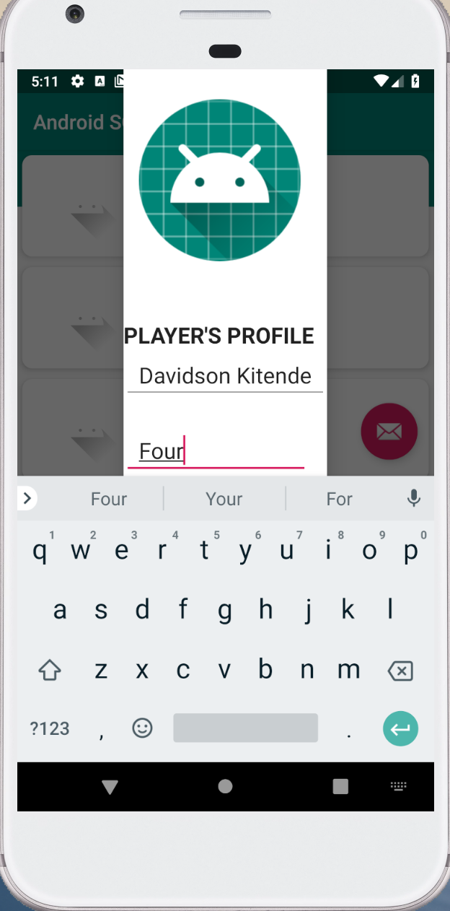
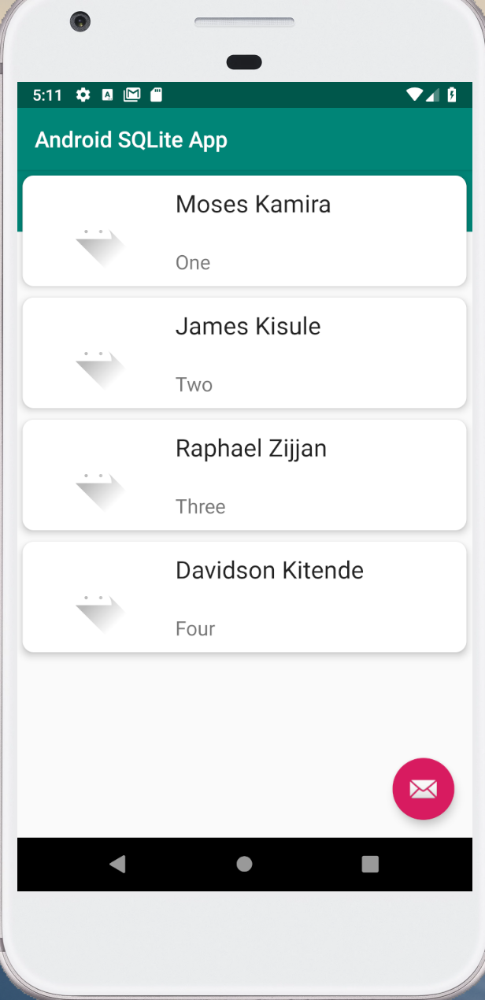

# AndroidSQLiteAPP
This project is intended to show the implementation of the SQLite database using SQLiteOpenHelper

## Aim of the project
Add Player information to the database and display it in a RecyclerView.

### Snapshot showing how to Add Player information

### Snapshot showing a List of available Players

### Future Improvements

Profile Image: Implement the use of dynamic profile image instead of the static image used currently  
Update Functionality: Implement the Update Player information functionality